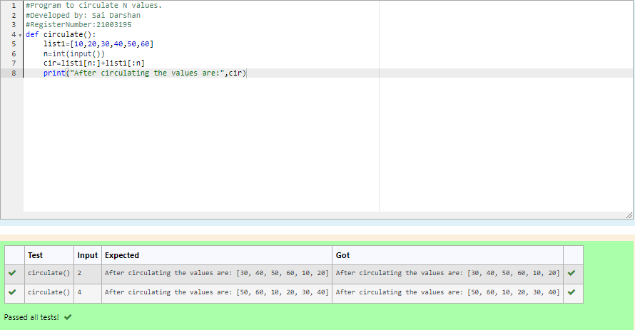

# Circulate-the-values-of-N-variables
## Aim:
To write a python program to circulate the n variables using function concept
## Equipment’s required:
PC
Anaconda - Python 3.7
## Algorithm: 
### Step 1: 
Get the two values from the user.
### Step 2: 
Assign the values.
### Step 3: 
Get the value from the user for the number of rotation.
### Step 4: 
Using the slicing concept rotate the list.

### Step 5: 
Print the output.
### Step 6: 
End the program.
## Program:
~~~
#Program to circulate N values.
#Developed by: Sai Darshan
#RegisterNumber:21003195
def circulate():
    list1=[10,20,30,40,50,60]
    n=int(input())
    cir=list1[n:]+list1[:n]
    print("After circulating the values are:",cir)
~~~
## Output:

## Result:
The values have been circulated and displayed. 